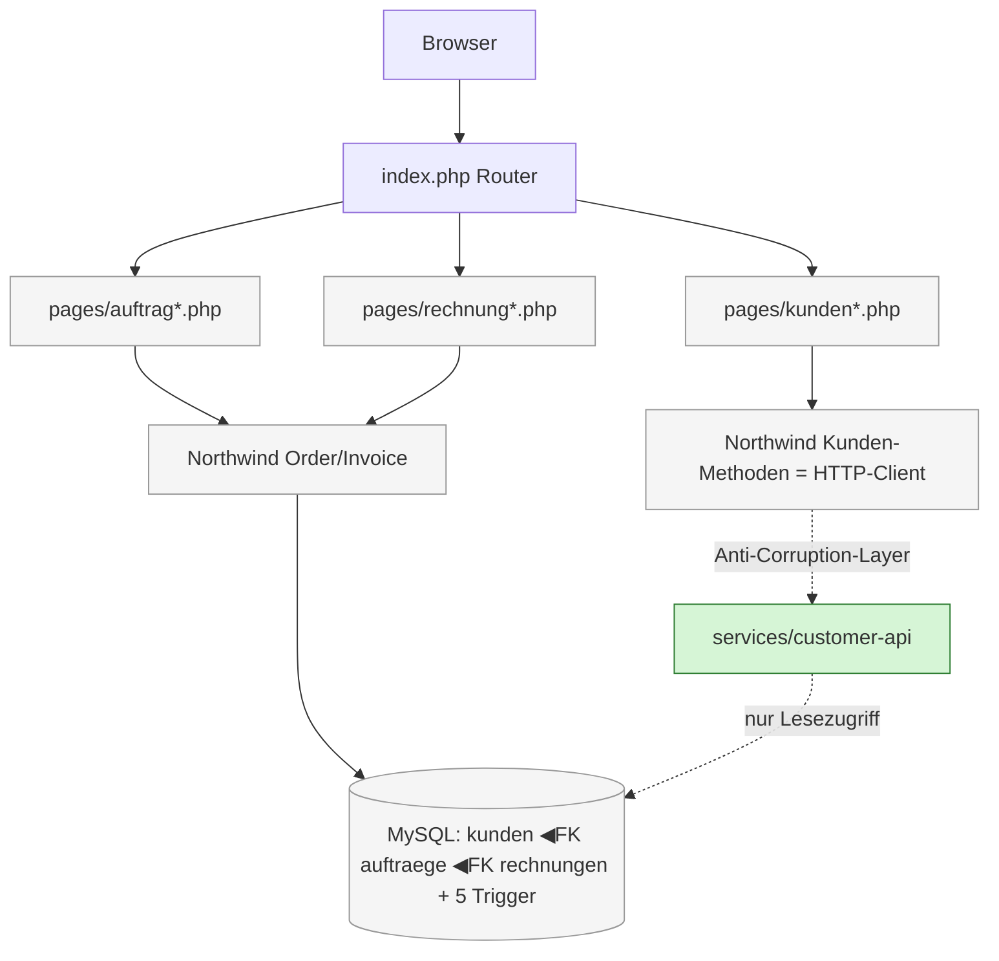

# ADR-001 — The Map: Strangler Fig, erster Schnitt = Customer API

- **Status:** Akzeptiert
- **Datum:** 2026-06-30
- **Kontext:** Hackathon Scenario 1 — Northwind Logistics Legacy-Monolith modernisieren
- **Entscheider:** Architektur-Spur (P1), abgestimmt mit Dev/Platform (P3), Testing (P2), Product (P4)
- **Verwandt:** [ADR-002 (Anti-Corruption-Layer / Fence)](ADR-002-anti-corruption-layer.md) ·
  [ADR-003 (Trigger → Application Code)](ADR-003-triggers-to-application-code.md) ·
  [capabilities.md](capabilities.md) · [User Stories](../../doc/stories/)

---

## Kontext

Der Vorstand will „Modernisierung". Niemand versteht den Monolithen vollständig. Die naheliegende,
falsche Antwort wäre ein **Big-Bang-Rewrite** — bei einer Codebasis mit verstecktem Verhalten
(5 DB-Trigger, 3-fach überschriebenes BAV-Singleton, doppelte Validierungslogik) ist das ein
garantierter Reinfall: Man re-implementiert Verhalten, das man nicht kennt, und merkt erst in
Produktion, was kaputt ist.

Wir brauchen (1) eine **Karte** des Patienten und (2) einen **ersten Schnitt**, der das Vorgehen
beweist. Die Capability-Map und MoSCoW-Priorisierung liegen bereits vor in
[`capabilities.md`](capabilities.md). Diese ADR trifft auf dieser Basis die **Schnitt-Entscheidung**.

---

## Entscheidung

1. **Strategie: Strangler Fig.** Services werden schrittweise hinter einem Anti-Corruption-Layer
   extrahiert, statt neu geschrieben. Der Monolith läuft die ganze Zeit weiter.
2. **Erster Schnitt: Customer API.** Wir extrahieren die Kundenstammdaten als erste Domäne.
3. **Ranking-Achse: Business-Priorität (MoSCoW) zuerst, technisches Risiko als zweite Achse.**
   Wir schneiden dort zuerst, wo der **Geschäftswert** am höchsten ist und das Risiko **beherrschbar**
   gemacht werden kann — nicht dort, wo das Risiko absolut am niedrigsten ist.
4. **Wir entfernen keine DB-Trigger und migrieren kein `mysql_*`**, bevor Characterization-Tests
   das Verhalten eingefroren haben (siehe ADR-003).

---

## Die Karte: Extraktionsreihenfolge (Business-Priorität → Risiko)

| # | Seam | MoSCoW | Schlüsselrisiko | De-Risking |
|---|---|---|---|---|
| 1 | **Customer API** | 🟥 MUST | `kunden_id` FK in `auftraege` **und** `rechnungen` | Referenzen bleiben im Monolith; Service stellt nur Lesezugriff bereit (Expand-Contract) |
| 2 | **Order-Management** | 🟥 MUST | Trigger 2+4 müssen explizit App-Code werden | ADR-003 zuerst; Trigger erst nach Test-Verifikation entfernen |
| 3 | **Invoice/Payment** | 🟥 MUST | Berührt alle Domänen; Trigger 1 + Rechnungsnummer-Sequence-Deadlock | zuletzt unter den MUSTs; nach Customer + Order stabil |
| 4 | Shipment-Tracking | 🟧 SHOULD | 3-fach denormalisierte Adresse, stale `tracking_url`, Trigger 3 ↔ Cron-Race | Adresse als Wertobjekt, Race über Idempotenz lösen |
| 5 | Bank-Validation | 🟦 COULD | Niedrigstes tech. Risiko, **aber** niedrigste Business-Priorität | jederzeit ziehbar; DB-frei testbar |

**Ranking-Logik:** Geschäftswert führt. Innerhalb gleicher Priorität entscheidet beherrschbares
Risiko. Customer API ist der FK-Anker für die beiden umsatzkritischsten Domänen (Order, Invoice) —
sie zuerst sauber zu kapseln zahlt sich bei jedem Folgeschnitt aus.

### Warum Customer API der erste Schnitt ist

- **Höchster Hebel:** Kundenstammdaten sind die Wurzel-Abhängigkeit für Auftrag *und* Rechnung
  (siehe Capability-Map in `capabilities.md`). Wer sie sauber kapselt, vereinfacht alle Folgeschnitte.
- **FK-Risiko ist beherrschbar, nicht eliminiert:** Wir lassen die FK-Spalten (`kunden_id`) physisch
  im Monolithen und geben dem Service zunächst nur **Lesezugriff** auf Kundendaten (Expand-Contract).
  Kein verteiltes Schreiben, kein Cross-DB-Write (vgl. Projektregel in Root-`CLAUDE.md`).
- **Direkt produkt-relevant:** Deckt die bereits formulierten Stories
  [US-007 (Kunde anlegen/bearbeiten)](../../doc/stories/US-007-kunde-anlegen-bearbeiten.md) und
  [US-008 (Bankdaten pflegen)](../../doc/stories/US-008-bankdaten-pflegen.md) ab.

### Verworfene Alternative: Bank-Validation zuerst (rein risiko-getrieben)

Ein früherer Vorschlag (und die „Empfohlene Extraktionsreihenfolge" am Ende von
[`capabilities.md`](capabilities.md), die hierdurch **überholt** ist) wollte
**Bank-Validation zuerst** schneiden — weil es das absolut niedrigste technische Risiko hat
(keine FK, DB-frei testbar) und nebenbei den 3-fach-`ConfigurationRegistry`-Bug beseitigt.

**Warum verworfen:** Bank-Validation ist eine COULD-Capability **ohne eigene UI** und mit dem
geringsten unmittelbaren Geschäftswert. Ein erster Schnitt soll nicht nur „einfach" sein, sondern
**Wert beweisen, den der Vorstand erkennt**. Das niedrige Risiko von Bank-Validation macht es zum
idealen *Notnagel* (jederzeit ziehbar, liefert einen grünen DB-freien Contract-Test als Fallback),
aber nicht zum ersten strategischen Schnitt.

> ⚠️ **Doku-Konflikt offen:** `capabilities.md` §„Empfohlene Extraktionsreihenfolge" listet noch
> Bank-Validation als #1. Diese ADR ist die maßgebliche Quelle; die Stelle in `capabilities.md`
> sollte auf diese ADR verweisen oder angeglichen werden.

---

## Die verstecktes-Verhalten-Falle: was vor JEDEM Schnitt bekannt sein muss

Diese Dinge sind **nicht** aus dem PHP-Code ersichtlich und gelten domänenübergreifend:

### Drei problematische Singletons (Global State)
| Variable | Wo gesetzt | Wo gelesen |
|---|---|---|
| `$db` | `init.php` (`mysql_connect`) | alle pages/, alle classes/ |
| `$_SESSION` | `init.php` | pages/, helper.php |
| `ConfigurationRegistry` | `init.php` **+** `BankValidator::__construct()` **+** `Northwind::verarbeiteZahlung()` | überall wo BAV läuft |

→ Die aktive BAV-Config zur Laufzeit hängt davon ab, **was zuletzt aufgerufen wurde**. Relevant,
sobald Invoice/Payment (Seam #3) geschnitten wird.

### Fünf DB-Trigger mit versteckter Business-Logic (Details → ADR-003)
| Trigger | Auslöser | Wirkung |
|---|---|---|
| `tr_rechnung_bezahlt` | `rechnungen.status='bezahlt'` | `auftraege.status=5` |
| `tr_lieferung_erstellt` | INSERT `lieferungen` | `auftraege.status=3` (wenn vorher 2) |
| `tr_lieferung_zugestellt` | `lieferungen.status='zugestellt'` | `auftraege.status=4` — **Bug: sollte 5** |
| `tr_auftrag_bestaetigt` | `auftraege.status` 1→2 | Lagerbestand dekrementieren |
| `tr_rechnung_nummer` | INSERT `rechnungen` | Rechnungsnummer `RE-JJJJ-NNNNN` |

→ **Storno-Bug:** `tr_auftrag_bestaetigt` zieht Lagerbestand ab, aber **kein** Trigger setzt ihn
bei Stornierung (Status 9) zurück → Lagerbestand läuft bei Storno dauerhaft falsch.

### Doppelte BLZ-Validierung (Bankkonten-Capability)
`helper.validateBankleitzahl()` (2009, nur Format) **und** `BankValidator::istGueltigeBLZ()`
(2015, Format + BAV) existieren parallel; manche Seiten rufen beide. Format-gültige, aber nicht
existierende BLZs rutschen durch. → Beim späteren Schnitt von Seam #5 zu bereinigen.

---

## Diagramm

### Ist-Zustand (vor dem Schnitt)

```
                         ┌──────────────────────────────────────────┐
   Browser  ──$_GET──▶   │  index.php  (if/elseif-Router, kein Auth) │
                         └───────────────────┬──────────────────────┘
                                             │ require
                                  ┌──────────▼───────────┐
                                  │  init.php (Bootstrap)│  setzt: $db, $_SESSION, ConfigRegistry
                                  └──────────┬───────────┘
                ┌────────────────────────────┼────────────────────────────┐
                ▼                             ▼                            ▼
        pages/kunden*.php           pages/auftrag*.php            pages/rechnung*.php
                │                             │                            │
                └──────────────┬─────────────┴──────────────┬─────────────┘
                               ▼                             ▼
                    classes/Northwind.php (God-Class, 30+ Methoden)
                               │
                               ▼
                    ┌─────────────────────────────────────────────┐
                    │  MySQL                                       │
                    │  kunden ◀──FK── auftraege ◀──FK── rechnungen │  + 5 ⚡ Trigger
                    └─────────────────────────────────────────────┘
                       ▲ kunden ist der FK-Anker für ALLES
```

### Ziel-Zustand (nach erstem Schnitt — Customer API, Expand-Contract)

```
                         ┌──────────────────────────────────────────┐
   Browser  ──$_GET──▶   │  index.php                               │
                         └───────────────────┬──────────────────────┘
                ┌────────────────────────────┼────────────────────────────┐
                ▼                             ▼                            ▼
        pages/kunden*.php           pages/auftrag*.php            pages/rechnung*.php
                │                             │                            │
                ▼                             └──────────────┬─────────────┘
   ┌──────────────────────┐                                 ▼
   │ Northwind.php         │                       Northwind.php (Order/Invoice
   │  (Kunden-Methoden →   │                        lesen kunden_id weiter lokal)
   │   HTTP-Client)        │
   └───────────┬──────────┘
   ════════════╪═══════════  Anti-Corruption-Layer (ADR-002, Fence-Hook)
               ▼
   ┌────────────────────────────────────────┐
   │  services/customer-api/                │  GET  /customers/{id}     (Lesezugriff)
   │  • eigene Sicht auf Kundenstamm        │  POST /customers          (Anlage)
   │  • KEINE Monolith-Feldnamen in der API │  PUT  /customers/{id}     (Pflege)
   │  • Schreibt NICHT in Monolith-DB       │  ▲ FK kunden_id bleibt physisch im Monolith
   └────────────────────────────────────────┘
```

### Dasselbe als Mermaid (Ziel-Zustand)



---

## Was wir bewusst NICHT tun

- ❌ **Kein Big-Bang-Rewrite.** Der Monolith bleibt während des gesamten Schnitts live.
- ❌ **Kein Cross-DB-Write.** Der Customer-Service schreibt nicht in die Monolith-DB und umgekehrt
  (Projektregel Root-`CLAUDE.md`). FK-Spalten bleiben physisch im Monolithen.
- ❌ **Kein `mysql_*` / `global $db`** im neuen Service.
- ❌ **Keine Monolith-Feldnamen** (`bankleitzahl`, `kontonummer`) in der öffentlichen Service-API
  (durchgesetzt per Fence-Hook, ADR-002).
- ❌ **Keine Trigger entfernen / kein `mysql_*` → PDO** in diesem Schritt — erst nach
  Characterization-Tests (ADR-003).
- ❌ **God-Class `Northwind.php` nicht refactorn** — nur die Kunden-Methoden auf den HTTP-Client umstellen.
- ❌ **Invoice/Payment nicht zuerst** — höchstes Risiko, kommt als letzter MUST.

---

## Konsequenzen

**Positiv**
- Erster Schnitt liefert sichtbaren Geschäftswert (Stammdaten als saubere, wiederverwendbare API).
- Kapselt den FK-Anker, der alle Folgeschnitte (Order, Invoice) vereinfacht.
- Beweist Strangler Fig + Anti-Corruption-Layer an einer realen MUST-Domäne.

**Negativ / Kosten (ehrlich)**
- **Höheres technisches Risiko als der risiko-minimale Pfad (Bank-Validation):** `kunden_id` ist
  FK in zwei Tabellen. Wir kaufen Geschäftswert mit zusätzlichem Integrations-Risiko.
  → Mitigation: Expand-Contract, Lesezugriff zuerst, FK bleibt im Monolithen, Schreibpfad erst
  wenn Characterization-Tests grün sind.
- Zusätzlicher Netzwerk-Hop (HTTP) → Latenz + neue Fehlerklasse (Service nicht erreichbar) muss
  fail-closed/degradiert behandelt werden.
- Der 3-fach-`ConfigurationRegistry`-Bug bleibt bestehen, bis Seam #5 geschnitten wird (er liegt
  nicht im Customer-Pfad). → bewusst akzeptiert, in ADR-003/Stories getrackt.

**Folgeentscheidungen**
- ADR-002 regelt die Anti-Corruption-Grenze und warum sie als Hook (hart) statt Prompt (weich) erzwungen wird.
- ADR-003 macht die 5 Trigger explizit, bevor Order/Invoice (Seam #2/#3) extrahiert werden.

---

## Verifikation

- Scouts-Subagents (`agentic/`) ranken die Seams unabhängig; ihr Ranking wird mit dieser Karte
  verglichen — Abweichungen + Begründung fließen zurück in diese ADR (insbesondere: bestätigen die
  Scouts business-first oder risk-first?).
- Erfolgskriterium des ersten Schnitts: Characterization-Suite (Monolith, MySQL) **+**
  Contract-Test (`services/customer-api/`) **grün auf demselben Commit**.
